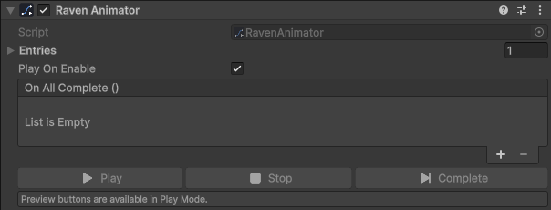

<p align="center">
  
</p>

<h1 align="center">RavenTween</h1>

<p align="center">
  High-performance, allocation-free tweening for Unity.<br>
  Fluent code-first API · sequences · async/await · shake &amp; punch · TextMeshPro · designer templates · live monitor
</p>

<p align="center">
  <a href="https://github.com/Nekuzaky/RavenTween/actions/workflows/tests.yml"></a>
  
  
  
</p>

---

## Why RavenTween

| | |
| --- | --- |
| **Zero steady-state GC** | Tween state lives in pooled, versioned slots. Property, effect, sequence and custom tweens allocate **0 bytes per frame** — enforced by tests, not promised in prose. |
| **Fast** | 5,000 simultaneous tweens step in **~0.77 ms/frame** (Editor, Mono, mixed workload). |
| **Safe by construction** | Handles are structs. A handle to a finished tween is just dead: every call on it is a no-op. Destroying a target mid-tween kills the tween cleanly and can notify you. |
| **No hidden state** | Tweens are single-use, like PrimeTween. Reuse configurations through `TweenTemplate` assets or `TweenParams` fields instead. |
| **Portable** | Pure managed C#: no threads, reflection, native plugins or runtime codegen. IL2CPP, WebGL, mobile and consoles are all fine. |

## Installation

**Package Manager** → `+` → *Add package from git URL…*

```
https://github.com/Nekuzaky/RavenTween.git?path=/Packages/com.raventween.core#v1.2.0
```

Or add it to `Packages/manifest.json`:

```json
"com.raventween.core": "https://github.com/Nekuzaky/RavenTween.git?path=/Packages/com.raventween.core#v1.2.0"
```

Requires Unity 2021.3 or newer. Unity 6 is fully supported.

## Quick start

```csharp
using RavenTween;

// Transforms
Raven.Position(transform, target, 0.6f).Ease(Ease.OutQuad);
transform.TweenScale(1.2f, 0.25f).Cycles(2, CycleMode.Yoyo);   // extension style

// Values
Raven.Value(0f, 1f, 0.5f).OnUpdate(v => fill.fillAmount = v);

// Timers
Raven.Delay(1.2f, () => Debug.Log("done"));
```

Tweens play as soon as they are created. `Start()` exists for explicit call sites and resumes a paused tween.

### Sequences

```csharp
Raven.Sequence()
    .Chain(Raven.AnchoredPosition(panel, Vector2.zero, 0.5f).Ease(Ease.OutBack)) // after the previous item
    .Group(Raven.Alpha(canvasGroup, 1f, 0.4f))                                   // alongside the previous item
    .Insert(0.2f, Raven.Scale(icon, 1f, 0.3f))                                   // at an absolute time
    .ChainDelay(0.25f)
    .Chain(Raven.Color(title, Color.white, 0.3f))
    .Cycles(2, CycleMode.Yoyo)
    .OnComplete(() => Debug.Log("sequence done"));
```

Sequences own their children and support nesting (`Chain(otherSequence)`), cycles, yoyo and infinite loops.

### Shake & punch

```csharp
Raven.ShakePosition(camera.transform, new Vector3(0.3f, 0.3f, 0f), 0.4f);   // screen shake
Raven.PunchScale(button, Vector3.one * 0.15f, 0.3f);                         // press feedback
transform.ShakeRotation(new Vector3(0f, 0f, 8f), 0.5f, frequency: 20f);
```

Effects oscillate around the value the target had when the effect started and always settle exactly on it.

### Custom tweens without allocations

Tween anything through a setter. With a **non-capturing** lambda the tween allocates nothing — the compiler caches the delegate and RavenTween caches the typed invoker.

```csharp
Raven.Custom(light, 0f, 8f, 1f, (l, v) => l.range = v);
Raven.Custom(this, Vector3.zero, Vector3.one, 1f, (self, v) => self.offset = v);
```

If the target is a `UnityEngine.Object`, the tween dies with it.

### TextMeshPro

Compiled automatically when TextMeshPro is present (built into uGUI 2.0 on Unity 6, or the `com.unity.textmeshpro` package on 2021/2022).

```csharp
title.TweenTypewriter(1.5f);                 // reveal characters
score.TweenNumber(0, 2500, 0.8f);            // allocation-free counter (TMP SetText)
label.TweenFontSize(64f, 0.3f);
Raven.Color(label, Color.red, 0.2f);         // TMP_Text is a Graphic: color and alpha just work
```

### Procedural animation

Two components layer life on top of your animations, and RavenTween blends them in and out:

```csharp
var look = head.gameObject.AddComponent<RavenLookAt>();   // head tracks a moving target
look.Target = player;
look.TweenWeight(0f, 0.5f);                               // ...and looks away

var tail = tailRoot.gameObject.AddComponent<RavenSpringChain>(); // swings, lags, settles
tail.Gravity = new Vector3(0f, -2f, 0f);
```

With Unity's **Animation Rigging** package installed, an optional module adds `constraint.TweenWeight(...)`, `rig.TweenWeight(...)` and two-bone IK helpers:

```csharp
await handIK.TweenReach(doorHandle.position, 0.4f);
handIK.TweenRelease(0.3f);
```

### Async / await and coroutines

```csharp
await Raven.Delay(1.2f);
await tween;                     // or tween.ToCompletion()
await sequence;

yield return tween.ToYieldInstruction();
```

Awaiting resumes when the tween completes **or** is killed.

### Cycles, callbacks, time

```csharp
tween.Cycles(4, CycleMode.Yoyo);          // ping-pong 4 times
tween.Infinite(CycleMode.Restart);        // forever

tween.OnStart(...).OnUpdate(...).OnComplete(...).OnKill(...).OnTargetDestroyed(...);

Raven.TimeScale = 0.5f;                   // global, independent of Time.timeScale
tween.UnscaledTime();                     // keeps playing while Time.timeScale == 0
Raven.UpdatePhase = UpdatePhase.LateUpdate;
```

### Easing

31 standard easings (`Sine`, `Quad`, `Cubic`, `Quart`, `Quint`, `Expo`, `Circ`, `Back`, `Elastic`, `Bounce` × In/Out/InOut, plus `Linear`), any `AnimationCurve`, or a delegate:

```csharp
tween.Ease(Ease.OutElastic);
tween.Ease(myCurve);
tween.Ease(t => t * t * (3f - 2f * t));
```

## Designer workflow (no code)



1. **Create → RavenTween → Tween Template** — pick the property, end value, duration, ease and cycles.
2. Add a **Raven Animator** to a GameObject, reference targets and templates, then enable *Play On Enable* or wire `Play()` to any UnityEvent.
3. For timelines, use **Raven Sequence Player**: each step chains, groups or inserts a template.

Preview with the **Play / Stop / Complete** buttons in Play Mode.

Expose `TweenParams` in your own components so designers can tune timing without recompiling:

```csharp
[SerializeField] TweenParams show = TweenParams.Default;

void Show() => show.ApplyTo(Raven.AnchoredPosition(panel, Vector2.zero, show.duration));
```

## Live monitor

**Tools → RavenTween → Monitor** lists every live tween and sequence with its target, property, progress and cycle count. Pause, complete or kill any of them from the row controls.


## Built-in targets

| Area | Methods |
| --- | --- |
| Transform | `Position`, `LocalPosition`, `Rotation`, `LocalRotation`, `EulerAngles`, `LocalEulerAngles`, `Scale` |
| Effects | `ShakePosition`, `ShakeRotation`, `ShakeScale`, `PunchPosition`, `PunchRotation`, `PunchScale` |
| UI | `AnchoredPosition`, `SizeDelta`, `Alpha(CanvasGroup)`, `Color(Graphic)`, `Alpha(Graphic)` |
| Camera | `FieldOfView`, `OrthographicSize`, `BackgroundColor` |
| Audio | `Volume`, `Pitch` |
| Material | `MaterialFloat`, `MaterialColor` (by property ID or name) |
| Rendering | `Color(SpriteRenderer)`, `Intensity(Light)`, `Color(Light)` |
| TextMeshPro | `TweenTypewriter`, `TweenMaxVisibleCharacters`, `TweenNumber`, `TweenFontSize`, `TweenCharacterSpacing` |
| Procedural | `RavenLookAt`, `RavenSpringChain` components; `TweenWeight`, `LookAtTarget` |
| Animation Rigging | `TweenWeight` (any constraint, `Rig`), `TweenReach`, `TweenRelease` |
| Anything | `Value(...)`, `Custom(target, from, to, duration, setter)`, `Delay` |

Every method also exists in extension form: `transform.TweenPosition(...)`, `material.TweenColor(...)`, `text.TweenTypewriter(...)`.

## Performance

Measured by the package's own test suite (`Tests/PerformanceTests.cs`), which fails the build on any regression:

| Scenario | Result |
| --- | --- |
| 5,000 mixed tweens (position, scale, rotation, shake, custom), steady state | **0 B** allocated per frame |
| 200 infinite sequences, including cycle wraps | **0 B** allocated per frame |
| Creating 1,000 tweens from a warm pool | **0 B** allocated |
| 5,000 mixed tweens, engine step cost | **~0.77 ms/frame** (Editor, Mono) |

What does allocate, by design: a lambda that **captures** a local (once, at creation — standard C#), `ToYieldInstruction()` (one small object per call) and `async` state machines. Use them for flow control, not per-frame work.

The *06 - Benchmark* sample spawns thousands of animated cubes with a live frame-time and GC readout.

## Migrating from DOTween / PrimeTween

| DOTween | PrimeTween | RavenTween |
| --- | --- | --- |
| `transform.DOMove(p, d)` | `Tween.Position(t, p, d)` | `Raven.Position(t, p, d)` |
| `DOVirtual.Float(a, b, d, cb)` | `Tween.Custom(a, b, d, cb)` | `Raven.Value(a, b, d).OnUpdate(cb)` |
| `DOTween.To(getter, setter, …)` | `Tween.Custom(target, …)` | `Raven.Custom(target, a, b, d, setter)` |
| `DOVirtual.DelayedCall(d, cb)` | `Tween.Delay(d, cb)` | `Raven.Delay(d, cb)` |
| `transform.DOShakePosition(d, s)` | `Tween.ShakeLocalPosition(t, s, d)` | `Raven.ShakePosition(t, s, d)` |
| `transform.DOPunchScale(p, d)` | `Tween.PunchScale(t, p, d)` | `Raven.PunchScale(t, p, d)` |
| `DOTween.Sequence().Append(x)` | `Sequence.Create().Chain(x)` | `Raven.Sequence().Chain(x)` |
| `.Join(x)` | `.Group(x)` | `.Group(x)` |
| `.Insert(t, x)` | `.Insert(t, x)` | `.Insert(t, x)` |
| `.SetLoops(n, LoopType.Yoyo)` | `cycles: n, CycleMode.Yoyo` | `.Cycles(n, CycleMode.Yoyo)` |
| `.SetEase(Ease.OutQuad)` | `ease: Ease.OutQuad` | `.Ease(Ease.OutQuad)` |
| `.SetUpdate(true)` | `useUnscaledTime: true` | `.UnscaledTime()` |
| `.Kill()` / `.Complete()` | `.Stop()` / `.Complete()` | `.Stop()` / `.Complete()` |
| `.WaitForCompletion()` | `.ToYieldInstruction()` | `.ToYieldInstruction()` |
| `await t.AsyncWaitForCompletion()` | `await tween` | `await tween` |

As with PrimeTween (and unlike DOTween), tweens are not reusable: create a new one each time, or use a `TweenTemplate`.

## Samples

Import from **Package Manager → RavenTween → Samples**. Each sample builds its own scene at runtime: add the demo component to an empty GameObject and press Play.

| Sample | Shows |
| --- | --- |
| 01 - UI Basics | Panel slide-in, canvas group fade, pulsing button |
| 02 - Gameplay | Hops, spins, patrol loop |
| 03 - Camera | Breathing zoom, background blend, punch zoom |
| 04 - Materials | Staggered material color waves |
| 05 - Complex Sequence | Nested Chain / Group / Insert driven by a coroutine |
| 06 - Benchmark | Thousands of tweens with frame-time and GC readout |
| 07 - TextMeshPro | Typewriter, number counter, punch feedback |
| 08 - Procedural | Head look-at and antenna spring, blended with weight tweens |

Samples work with both the legacy Input Manager and the Input System package.

## FAQ

**What happens if the target is destroyed mid-tween?** The tween dies on its next update and fires `OnTargetDestroyed` if subscribed. No exceptions, no leaks.

**What happens at `Time.timeScale = 0`?** Scaled tweens freeze; `UnscaledTime()` tweens keep playing — ideal for pause menus.

**Is it thread-safe?** The API is main-thread only, like the Unity API it drives. The engine itself uses no threads.

**Does it work with Enter Play Mode Options (no domain reload)?** Yes. Engine state resets on `SubsystemRegistration`.

**Which platforms?** Everything Unity targets: the runtime is pure managed C# with no platform-specific code. The repository's CI workflow runs the full test suite on Linux against Unity 2021.3, 2022.3 and 6.

## Support

RavenTween is free and MIT licensed. If it saves you time, you can support its development through [GitHub Sponsors](https://github.com/sponsors/nekuzaky) or [Buy Me a Coffee](https://buymeacoffee.com/nekuzaky).

## License

MIT — see [LICENSE.md](LICENSE.md). Editor glyphs from Bootstrap Icons (MIT), see [Third Party Notices.md](Third%20Party%20Notices.md).
